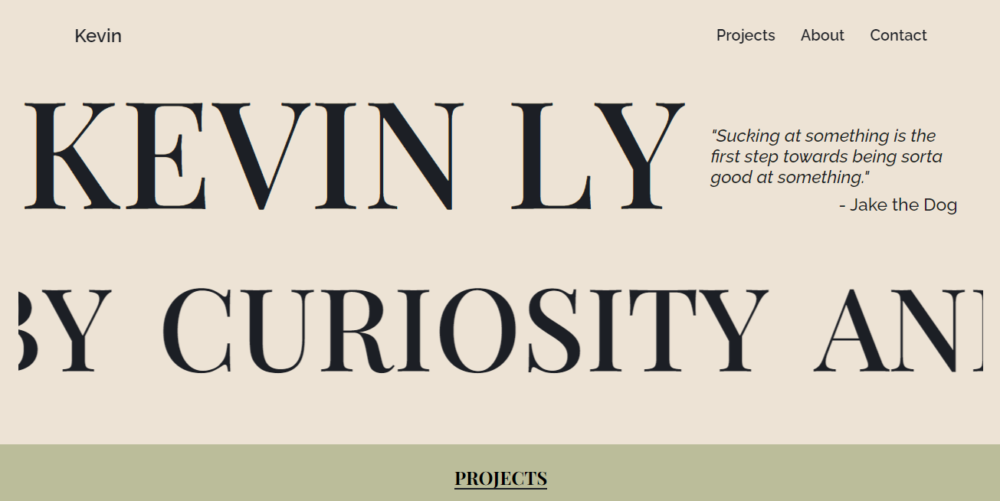
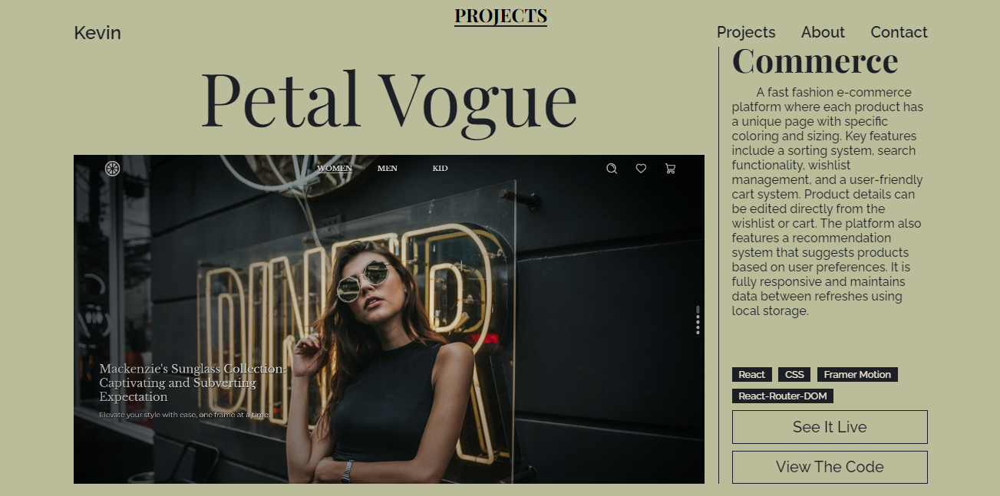
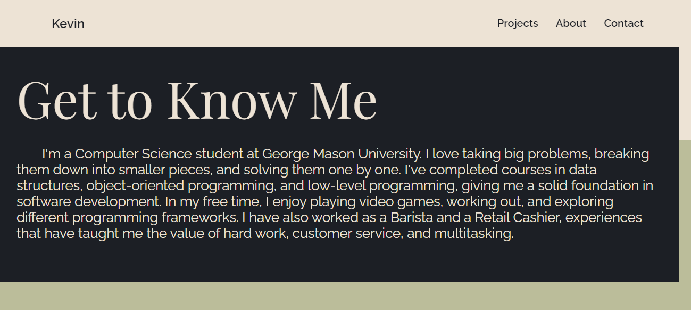
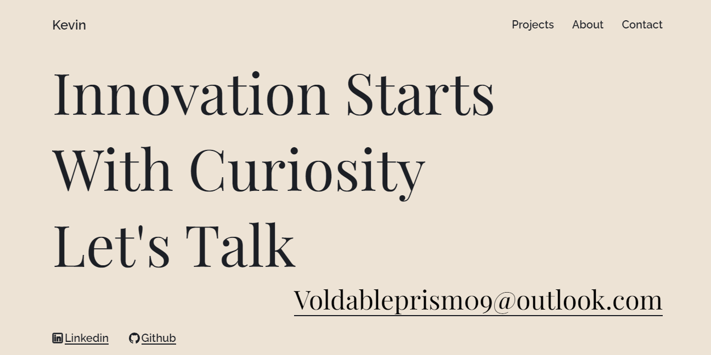

# PortfolioV3
This repository showcases my projects and skills as a web developer

## Table of Contents
- [Access](#Access)
- [Installation](#installation)
- [Tech Stack](#tech-stack)
- [Project Structure](#project-structure)
- [Screenshots](#Screenshots)
- [License](#license)

## Access
Accessible from https://portfolio-v3-kevin-lys-projects.vercel.app 

## Installation
1. **Clone the repository:**
    ```bash
    git clone https://github.com/Ama4538/PortfolioV3.git
    cd PortfolioV3
    ```
2. **Install dependencies:**
    ```bash
    npm i
    ```
3. **Build and Start the server:**
    ```bash
    npm build
    npm preview
    ```
4. **Access the application:**
Open your browser and go to localhost

## Tech Stack
- React
- JS
- CSS
- HTML

## Project Structure
```
├── public/                 # Static Files
│   ├── icons/              # All icons
│   ├── project-images/     # All project images 
├── src/                    # Source folder
│   ├── component/          # Contains all react component
│   ├── data.json           # Data about every projects
│   ├── main.css            # Styling
│   ├── main.jsx            # Entry point
├── index.html              # Starting html file
├── .gitignore              # Git ignore file
└── package.json            # Project metadata and dependencies
```

## Screenshots




## License
Distributed under the MIT License. See `LICENSE` for more information.